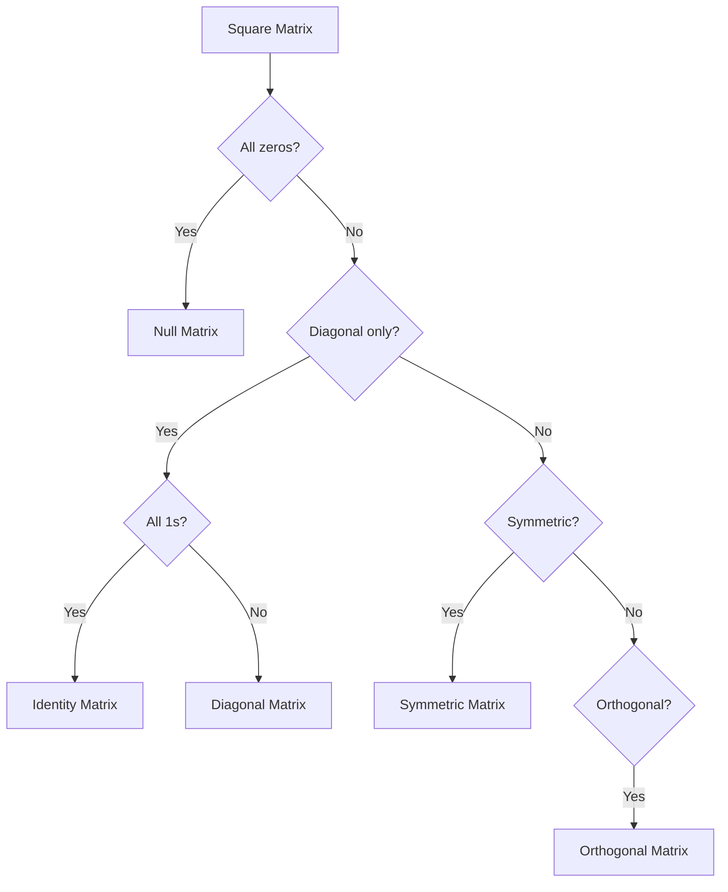

# 📋 Linear Algebra - Cheat Sheet

> Quick reference formulas, shortcuts, and tips for GATE AG

---

## 🎯 Quick Formula Reference

### 1. Determinants

#### $2 \times 2$ Matrix
$$
\begin{vmatrix} a & b \\ c & d \end{vmatrix} = ad - bc
$$

**Shortcut:** Cross multiply diagonals, subtract

#### $3 \times 3$ Matrix
$$
\begin{vmatrix} a & b & c \\ d & e & f \\ g & h & i \end{vmatrix} = a(ei-fh) - b(di-fg) + c(dh-eg)
$$

**Shortcut (Sarrus' Rule):** 
```
   a  b  c | a  b
   d  e  f | d  e
   g  h  i | g  h
   ↘ ↘ ↘   ↗ ↗ ↗
  (+)     (-)
```
Sum: $aei + bfg + cdh - ceg - afh - bdi$

---

### 2. Matrix Inverse

#### $2 \times 2$ Inverse (⭐ Most Important!)
$$
\begin{bmatrix} a & b \\ c & d \end{bmatrix}^{-1} = \frac{1}{ad-bc} \begin{bmatrix} d & -b \\ -c & a \end{bmatrix}
$$

**Memory Trick:** "Swap diagonals, flip signs of off-diagonals, divide by determinant"

#### $3 \times 3$ Inverse
$$
A^{-1} = \frac{1}{\det(A)} \text{adj}(A)
$$

**Quick Steps:**
1. Find $\det(A)$
2. Find cofactor matrix
3. Transpose cofactor matrix (= adjoint)
4. Divide by determinant

---

### 3. Eigenvalues

#### Characteristic Equation
$$
\det(A - \lambda I) = 0
$$

#### For $2 \times 2$ Matrix
$$
A = \begin{bmatrix} a & b \\ c & d \end{bmatrix}
$$

$$
\lambda^2 - (a+d)\lambda + (ad-bc) = 0
$$

**Shortcut Formula:**
$$
\lambda^2 - \text{Trace}(A) \cdot \lambda + \det(A) = 0
$$

**Solving:** Use quadratic formula
$$
\lambda = \frac{(a+d) \pm \sqrt{(a+d)^2 - 4(ad-bc)}}{2}
$$

---

### 4. Key Properties

#### Determinant Properties
| Property | Formula |
|----------|---------|
| Transpose | $\det(A^T) = \det(A)$ |
| Product | $\det(AB) = \det(A) \cdot \det(B)$ |
| Inverse | $\det(A^{-1}) = \frac{1}{\det(A)}$ |
| Scalar multiple | $\det(kA) = k^n\det(A)$ for $n \times n$ |
| Triangular | $\det(A) = \prod a_{ii}$ |

#### Eigenvalue Properties
| Property | Formula |
|----------|---------|
| Sum | $\sum \lambda_i = \text{Trace}(A) = \sum a_{ii}$ |
| Product | $\prod \lambda_i = \det(A)$ |
| Of $A^{-1}$ | $\lambda(A^{-1}) = \frac{1}{\lambda(A)}$ |
| Of $A^k$ | $\lambda(A^k) = [\lambda(A)]^k$ |
| Of $A^T$ | $\lambda(A^T) = \lambda(A)$ |

#### Matrix Operations
| Operation | Formula |
|-----------|---------|
| $(A^T)^T$ | $= A$ |
| $(A + B)^T$ | $= A^T + B^T$ |
| $(AB)^T$ | $= B^T A^T$ ⚠️ Order reverses! |
| $(A^{-1})^T$ | $= (A^T)^{-1}$ |
| $(AB)^{-1}$ | $= B^{-1}A^{-1}$ ⚠️ Order reverses! |

---

## ⚡ Quick Solution Methods

### Cramer's Rule ($2 \times 2$ System)

For system:
$$
\begin{cases}
a_1x + b_1y = c_1 \\
a_2x + b_2y = c_2
\end{cases}
$$

$$
x = \frac{D_x}{D}, \quad y = \frac{D_y}{D}
$$

where:
$$
D = \begin{vmatrix} a_1 & b_1 \\ a_2 & b_2 \end{vmatrix}, \quad
D_x = \begin{vmatrix} c_1 & b_1 \\ c_2 & b_2 \end{vmatrix}, \quad
D_y = \begin{vmatrix} a_1 & c_1 \\ a_2 & c_2 \end{vmatrix}
$$

**Memory:** Replace column with constants, keep same order

---

### System of Equations - Solution Types

| Case | Condition | Solution |
|------|-----------|----------|
| **Unique** | $\det(A) \neq 0$ | One solution: $X = A^{-1}B$ |
| **Infinite** | $\det(A) = 0$, rank$(A)$ = rank$([A\|B])$ | Many solutions |
| **No solution** | $\det(A) = 0$, rank$(A) <$ rank$([A\|B])$ | Inconsistent |

---

## 🎯 GATE-Specific Shortcuts

### Quick Checks

#### 1. Singular Matrix Check
Matrix $A$ is singular (non-invertible) if:
- $\det(A) = 0$, OR
- Two rows/columns are identical, OR
- One row/column is all zeros, OR
- One row/column is linear combination of others

#### 2. Symmetric Matrix Check
$A$ is symmetric if $a_{ij} = a_{ji}$ for all $i,j$

**Quick visual:** Mirror along main diagonal

#### 3. Orthogonal Matrix Check
$A$ is orthogonal if $AA^T = I$

**Property:** $\det(A) = \pm 1$

---

### Common Matrix Types - Quick Recognition



---

## 💡 Problem-Solving Tips

### Tip 1: Finding Rank Quickly

**For small matrices:**
1. If $\det(A) \neq 0$ → rank = $n$ (full rank)
2. If $\det(A) = 0$ → check smaller minors
3. Count non-zero rows in row-echelon form

### Tip 2: Eigenvector Shortcut (for $2 \times 2$)

After finding $\lambda$, eigenvector components have ratio:
$$
\frac{x}{y} = \frac{b}{\lambda - a} = \frac{\lambda - d}{c}
$$

### Tip 3: Diagonal Matrix Properties

For diagonal matrix $D$:
- $\det(D) = d_1 \cdot d_2 \cdot \ldots \cdot d_n$
- Eigenvalues = diagonal elements
- $D^k$ = diagonal matrix with elements $d_i^k$

### Tip 4: Trace Calculations

**Trace** (sum of diagonal elements):
- $\text{tr}(A + B) = \text{tr}(A) + \text{tr}(B)$
- $\text{tr}(kA) = k \cdot \text{tr}(A)$
- $\text{tr}(AB) = \text{tr}(BA)$
- $\text{tr}(A^T) = \text{tr}(A)$

---

## ⚠️ Common Mistakes to Avoid

### ❌ Mistake 1: Matrix Multiplication Order
**Wrong:** $AB = BA$  
**Correct:** Matrix multiplication is NOT commutative

**Exception:** When both are diagonal matrices or one is identity

### ❌ Mistake 2: Transpose of Product
**Wrong:** $(AB)^T = A^T B^T$  
**Correct:** $(AB)^T = B^T A^T$ (order reverses!)

### ❌ Mistake 3: Determinant of Sum
**Wrong:** $\det(A + B) = \det(A) + \det(B)$  
**Correct:** No such property! Must calculate directly

### ❌ Mistake 4: Scalar Multiplication in Determinant
**Wrong:** $\det(kA) = k \det(A)$  
**Correct:** $\det(kA) = k^n \det(A)$ for $n \times n$ matrix

### ❌ Mistake 5: Eigenvalue of Sum
**Wrong:** $\lambda(A+B) = \lambda(A) + \lambda(B)$  
**Correct:** No such property!

---

## 🔢 Standard Results to Memorize

### 1. Special Determinants

$$
\begin{vmatrix} 1 & 1 & 1 \\ a & b & c \\ a^2 & b^2 & c^2 \end{vmatrix} = (a-b)(b-c)(c-a)
$$

$$
\begin{vmatrix} 1 & 1 & 1 \\ a & b & c \\ a^3 & b^3 & c^3 \end{vmatrix} = (a-b)(b-c)(c-a)(a+b+c)
$$

### 2. Block Matrices

$$
\det\begin{bmatrix} A & 0 \\ 0 & B \end{bmatrix} = \det(A) \cdot \det(B)
$$

$$
\det\begin{bmatrix} A & B \\ 0 & C \end{bmatrix} = \det(A) \cdot \det(C)
$$

### 3. Identity Matrix Results

- $AI = IA = A$
- $\det(I) = 1$
- $I^{-1} = I$
- $I^T = I$

---

## 📊 Quick Reference Table

### Matrix Size vs Operations

| Size | Det Method | Inverse Method | Time |
|------|-----------|----------------|------|
| $2 \times 2$ | Cross multiply | Direct formula | 10 sec |
| $3 \times 3$ | Sarrus/Cofactor | Adjoint method | 1-2 min |
| $n \times n$ | Row reduction | Gauss-Jordan | 3-5 min |

---

## 🎯 Exam Strategy

### Time Management
- $2 \times 2$ problems: **≤ 2 minutes**
- $3 \times 3$ problems: **≤ 4 minutes**
- Eigenvalue problems: **≤ 3 minutes**

### Priority Order (attempt easy ones first)
1. ✅ Determinant of $2 \times 2$ or $3 \times 3$
2. ✅ Properties-based questions (no calculation)
3. ✅ Eigenvalues of $2 \times 2$
4. ✅ System of equations with $2 \times 2$
5. ⚠️ Complex calculations (attempt if time permits)

### Verification Tricks
- **Inverse check:** $AA^{-1} = I$
- **Eigenvalue check:** Sum = Trace, Product = Det
- **Solution check:** Substitute back in original equations

---

## 📝 Practice Problems by Difficulty

### Easy (1 mark questions)
- Determinant of $2 \times 2$ matrix
- Transpose of matrix
- Sum/difference of matrices
- Trace calculation
- Type of matrix (symmetric, diagonal, etc.)

### Medium (2 mark questions)
- Inverse of $2 \times 2$ matrix
- Determinant of $3 \times 3$ matrix
- Eigenvalues of $2 \times 2$ matrix
- Cramer's rule for $2 \times 2$
- Rank of matrix

### Hard (2 mark questions)
- Inverse of $3 \times 3$ matrix
- Eigenvectors calculation
- System of 3 equations
- Properties with proof
- Mixed concepts

---

## 🔥 Last-Minute Revision (5 minutes before exam)

### Must-Know Formulas
1. $2 \times 2$ determinant: $ad - bc$
2. $2 \times 2$ inverse: Swap & flip, divide by det
3. Eigenvalue equation: $\det(A - \lambda I) = 0$
4. For $2 \times 2$: $\lambda^2 - \text{Tr}(A) \cdot \lambda + \det(A) = 0$
5. Properties: $(AB)^T = B^TA^T$, $(AB)^{-1} = B^{-1}A^{-1}$

### Don't Forget
- Matrix multiplication ≠ commutative
- $\det(kA_{n \times n}) = k^n \det(A)$
- Sum of eigenvalues = Trace
- Product of eigenvalues = Determinant

---

## 📚 Additional Resources

- [Concepts](./Concepts.md) - Detailed theory
- [PYQ Solutions](./PYQ_Solutions.md) - Practice problems
- [Back to Engineering Mathematics](../README.md)

---

<div align="center">

**Print this sheet for quick revision! 📄**

**Practice daily for mastery! 🎯**

[⬅️ Concepts](./Concepts.md) | [Main Index 🏠](../../README.md) | [PYQ Solutions ➡️](./PYQ_Solutions.md)

</div>
