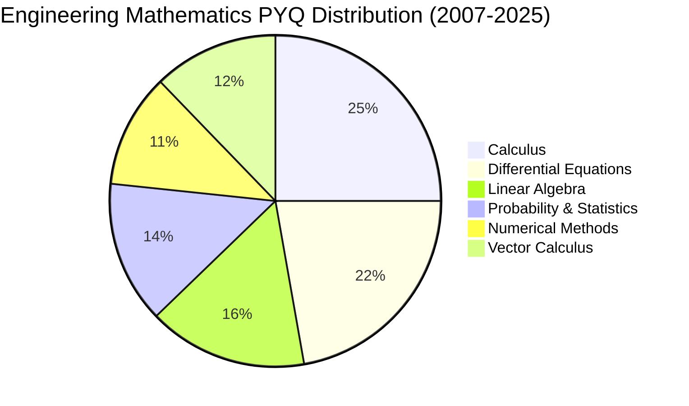

# 📐 Engineering Mathematics - GATE AG

> Foundation mathematics for Agricultural Engineering - 15% weightage (~15 marks)

---

## 📚 Overview

Engineering Mathematics forms the foundation for all technical subjects in GATE AG. This section covers fundamental mathematical concepts essential for problem-solving across all agricultural engineering domains.

**Weightage:** ~15 marks (15% of total)  
**Questions:** Typically 8-10 questions  
**Difficulty:** Easy to Medium (mostly)

---

## 📖 Topics Covered

### 1. Linear Algebra
[📂 Go to topic folder](./Linear_Algebra/)

**Subtopics:**
- Matrix Operations
- Determinants
- System of Linear Equations
- Eigenvalues and Eigenvectors
- Rank of Matrix
- Linear Transformations

**PYQ Frequency:** ⭐⭐⭐⭐ (High)  
**Avg. Questions/Year:** 1-2

---

### 2. Calculus
[📂 Go to topic folder](./Calculus/)

**Subtopics:**
- Limits and Continuity
- Differentiation
- Partial Derivatives
- Maxima and Minima
- Integration (Definite & Indefinite)
- Applications of Integration

**PYQ Frequency:** ⭐⭐⭐⭐⭐ (Very High)  
**Avg. Questions/Year:** 2-3

---

### 3. Vector Calculus
[📂 Go to topic folder](./Vector_Calculus/)

**Subtopics:**
- Vector Operations
- Gradient, Divergence, Curl
- Line Integrals
- Surface Integrals
- Volume Integrals
- Green's, Stokes', Gauss Divergence Theorems

**PYQ Frequency:** ⭐⭐⭐ (Moderate)  
**Avg. Questions/Year:** 1-2

---

### 4. Differential Equations
[📂 Go to topic folder](./Differential_Equations/)

**Subtopics:**
- First Order ODEs
- Second Order ODEs
- Linear Differential Equations
- Exact Differential Equations
- Applications in Engineering

**PYQ Frequency:** ⭐⭐⭐⭐⭐ (Very High)  
**Avg. Questions/Year:** 2-3

---

### 5. Probability & Statistics
[📂 Go to topic folder](./Probability_Statistics/)

**Subtopics:**
- Probability Basics
- Random Variables
- Probability Distributions
- Mean, Median, Mode, Variance
- Correlation and Regression
- Hypothesis Testing

**PYQ Frequency:** ⭐⭐⭐⭐ (High)  
**Avg. Questions/Year:** 1-2

---

### 6. Numerical Methods
[📂 Go to topic folder](./Numerical_Methods/)

**Subtopics:**
- Interpolation (Lagrange, Newton)
- Numerical Integration (Trapezoidal, Simpson's)
- Solution of Equations (Newton-Raphson, Bisection)
- Solution of ODEs (Euler, Runge-Kutta)

**PYQ Frequency:** ⭐⭐⭐ (Moderate)  
**Avg. Questions/Year:** 1-2

---

## 📊 PYQ Analysis (2007-2025)

### Topic-wise Question Distribution

### Difficulty Distribution

| Difficulty | Percentage | Strategy |
|------------|-----------|----------|
| **Easy** | 40% | Must-score questions - practice speed |
| **Medium** | 45% | Core understanding needed |
| **Hard** | 15% | Advanced concepts - can skip if short on time |

---

## 🎯 Preparation Strategy

### High Priority Topics (Do First)
1. ✅ **Calculus** - Differentiation, Integration, Maxima/Minima
2. ✅ **Differential Equations** - First and Second Order ODEs
3. ✅ **Linear Algebra** - Matrix operations, Eigenvalues
4. ✅ **Probability & Statistics** - Distributions, Mean, Variance

### Medium Priority Topics
5. **Numerical Methods** - Newton-Raphson, Simpson's Rule
6. **Vector Calculus** - Gradient, Divergence, Curl

### Time Allocation (Week 1-2 of preparation)
- **Day 1-2:** Linear Algebra
- **Day 3-5:** Calculus
- **Day 6-7:** Differential Equations
- **Day 8-9:** Probability & Statistics
- **Day 10-11:** Numerical Methods
- **Day 12-13:** Vector Calculus
- **Day 14:** Revision + Mock Test

---

## 💡 Quick Tips

### Formula Memory
- Create flashcards for integration formulas
- Practice derivative rules daily
- Memorize standard differential equation solutions
- Remember probability distribution formulas

### Common Mistakes to Avoid
⚠️ Not checking domain/range in calculus  
⚠️ Sign errors in matrix operations  
⚠️ Forgetting constant of integration  
⚠️ Mixing up probability vs statistics formulas  

### Time-Saving Tricks
💡 Use standard results for complex integrals  
💡 Identify linear algebra patterns  
💡 Memorize common differential equation forms  
💡 Use approximation for numerical methods  

---

## 📈 Year-wise Analysis

| Year | Total Questions | Easy | Medium | Hard | Topics Covered |
|------|----------------|------|--------|------|----------------|
| 2025 | 10 | 4 | 5 | 1 | All major topics |
| 2024 | 9 | 3 | 5 | 1 | Calculus, DE, LA |
| 2023 | 10 | 5 | 4 | 1 | All topics |
| 2022 | 10 | 4 | 5 | 1 | Focus on Calculus |
| 2021 | 9 | 4 | 4 | 1 | DE heavy |

---

## 🔗 Important Cross-References

Engineering Mathematics concepts are used extensively in:

### Direct Applications
- **Fluid Mechanics** → Differential Equations, Vector Calculus
- **Heat Transfer** → Differential Equations, Calculus
- **Soil Mechanics** → Linear Algebra, Statistics
- **Hydrology** → Probability & Statistics
- **Numerical Modeling** → Numerical Methods

### See Also
- [Fluid Mechanics](../04_Soil_Water_Conservation/Fluid_Mechanics/README.md)
- [Heat Transfer](../07_Dairy_Food_Engineering/Heat_Mass_Transfer/README.md)
- [Hydrology](../04_Soil_Water_Conservation/Hydrology/README.md)

---

## 📚 Recommended Approach

### For Beginners
1. Start with basic concepts
2. Solve topic-wise questions
3. Use cheat sheets for formulas
4. Practice easier PYQs first

### For Advanced Learners
1. Focus on tricky problems
2. Solve mixed topic questions
3. Work on speed and accuracy
4. Attempt harder PYQs

---

## 📝 Resources

### Each Topic Folder Contains:
- **Concepts.md** - Complete theory with examples
- **PYQ_Solutions.md** - Year-wise solved problems
- **CheatSheet.md** - Formulas, shortcuts, tips

### How to Study:
1. Read Concepts.md thoroughly
2. Make notes of formulas
3. Try PYQs yourself first
4. Check solutions
5. Revise using CheatSheet.md

---

## 🎯 Quick Navigation

| Topic | Concepts | Solutions | Cheat Sheet |
|-------|----------|-----------|-------------|
| Linear Algebra | [📖](./Linear_Algebra/Concepts.md) | [✅](./Linear_Algebra/PYQ_Solutions.md) | [📋](./Linear_Algebra/CheatSheet.md) |
| Calculus | [📖](./Calculus/Concepts.md) | [✅](./Calculus/PYQ_Solutions.md) | [📋](./Calculus/CheatSheet.md) |
| Vector Calculus | [📖](./Vector_Calculus/Concepts.md) | [✅](./Vector_Calculus/PYQ_Solutions.md) | [📋](./Vector_Calculus/CheatSheet.md) |
| Differential Equations | [📖](./Differential_Equations/Concepts.md) | [✅](./Differential_Equations/PYQ_Solutions.md) | [📋](./Differential_Equations/CheatSheet.md) |
| Probability & Statistics | [📖](./Probability_Statistics/Concepts.md) | [✅](./Probability_Statistics/PYQ_Solutions.md) | [📋](./Probability_Statistics/CheatSheet.md) |
| Numerical Methods | [📖](./Numerical_Methods/Concepts.md) | [✅](./Numerical_Methods/PYQ_Solutions.md) | [📋](./Numerical_Methods/CheatSheet.md) |

---

[⬅️ Back to Main Index](../README.md) | [➡️ Next: Farm Machinery](../02_Farm_Machinery/README.md)

