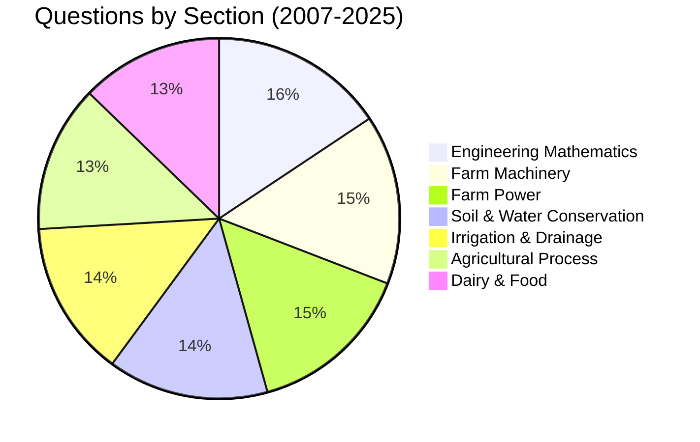

# 📚 GATE Agricultural Engineering - Complete Book Bank

> A comprehensive repository of concepts, solutions, and shortcuts for GATE AG preparation covering 19 years of PYQs (2007-2025)

[]()
[]()
[]()

---

## 📖 Table of Contents

- [Overview](#overview)
- [Repository Structure](#repository-structure)
- [How to Use This Repository](#how-to-use-this-repository)
- [Subject-wise Index](#subject-wise-index)
- [PYQ Analysis](#pyq-analysis)
- [Study Plan](#study-plan)
- [Contributing](#contributing)

---

## 🎯 Overview

This repository contains:
- **Complete syllabus coverage** for all GATE AG topics
- **19 years of PYQs** (2007-2025) with detailed solutions
- **Cheat sheets** with formulas, shortcuts, and tips
- **Difficulty-wise classification** of questions
- **Topic-wise tagging** for easy navigation
- **Mermaid diagrams** for complex concepts
- **Cross-references** between related topics

---

## 📁 Repository Structure

```
GATE_AG_BookBank/
│
├── 01_Engineering_Mathematics/
│   ├── README.md (Subject Overview)
│   ├── Linear_Algebra/
│   │   ├── Concepts.md
│   │   ├── PYQ_Solutions.md
│   │   └── CheatSheet.md
│   ├── Calculus/
│   ├── Vector_Calculus/
│   ├── Differential_Equations/
│   ├── Probability_Statistics/
│   └── Numerical_Methods/
│
├── 02_Farm_Machinery/
│   ├── README.md
│   ├── Machine_Design/
│   ├── Farm_Machinery_Principles/
│   ├── Performance_Parameters/
│   └── Cost_Analysis/
│
├── 03_Farm_Power/
│   ├── README.md
│   ├── IC_Engines/
│   ├── Tractors/
│   ├── Power_Tillers/
│   ├── Transmission_Systems/
│   └── Traction_Theory/
│
├── 04_Soil_Water_Conservation/
│   ├── README.md
│   ├── Fluid_Mechanics/
│   ├── Soil_Mechanics/
│   ├── Hydrology/
│   ├── Surveying_Leveling/
│   ├── Soil_Water_Erosion/
│   └── Watershed_Management/
│
├── 05_Irrigation_Drainage/
│   ├── README.md
│   ├── Soil_Water_Plant_Relationship/
│   ├── Irrigation_Methods/
│   ├── Drainage_Systems/
│   ├── Groundwater_Hydrology/
│   └── Wells_Pumps/
│
├── 06_Agricultural_Process_Engineering/
│   ├── README.md
│   ├── Engineering_Properties/
│   ├── Evaporation_Drying/
│   ├── Size_Reduction/
│   ├── Material_Handling/
│   ├── Processing/
│   └── Storage_Systems/
│
├── 07_Dairy_Food_Engineering/
│   ├── README.md
│   ├── Heat_Mass_Transfer/
│   ├── Food_Preservation/
│   ├── Material_Energy_Balance/
│   └── Sorption_Isotherms/
│
└── 08_General_Aptitude/
    ├── README.md
    ├── Verbal_Ability/
    └── Numerical_Ability/
```

---

## 🎓 Subject-wise Index

### Section 1: Engineering Mathematics (15% weightage)

| Topic | Concepts | PYQ Solutions | Cheat Sheet |
|-------|----------|---------------|-------------|
| **Linear Algebra** | [📖](./01_Engineering_Mathematics/Linear_Algebra/Concepts.md) | [✅](./01_Engineering_Mathematics/Linear_Algebra/PYQ_Solutions.md) | [📋](./01_Engineering_Mathematics/Linear_Algebra/CheatSheet.md) |
| **Calculus** | [📖](./01_Engineering_Mathematics/Calculus/Concepts.md) | [✅](./01_Engineering_Mathematics/Calculus/PYQ_Solutions.md) | [📋](./01_Engineering_Mathematics/Calculus/CheatSheet.md) |
| **Vector Calculus** | [📖](./01_Engineering_Mathematics/Vector_Calculus/Concepts.md) | [✅](./01_Engineering_Mathematics/Vector_Calculus/PYQ_Solutions.md) | [📋](./01_Engineering_Mathematics/Vector_Calculus/CheatSheet.md) |
| **Differential Equations** | [📖](./01_Engineering_Mathematics/Differential_Equations/Concepts.md) | [✅](./01_Engineering_Mathematics/Differential_Equations/PYQ_Solutions.md) | [📋](./01_Engineering_Mathematics/Differential_Equations/CheatSheet.md) |
| **Probability & Statistics** | [📖](./01_Engineering_Mathematics/Probability_Statistics/Concepts.md) | [✅](./01_Engineering_Mathematics/Probability_Statistics/PYQ_Solutions.md) | [📋](./01_Engineering_Mathematics/Probability_Statistics/CheatSheet.md) |
| **Numerical Methods** | [📖](./01_Engineering_Mathematics/Numerical_Methods/Concepts.md) | [✅](./01_Engineering_Mathematics/Numerical_Methods/PYQ_Solutions.md) | [📋](./01_Engineering_Mathematics/Numerical_Methods/CheatSheet.md) |

### Section 2: Farm Machinery (15% weightage)

[📂 View Complete Section](./02_Farm_Machinery/README.md)

**Key Topics:**
- Machine Design Fundamentals
- Farm Machinery Principles
- Performance Parameters
- Cost Economics

### Section 3: Farm Power (15% weightage)

[📂 View Complete Section](./03_Farm_Power/README.md)

**Key Topics:**
- IC Engines & Performance
- Tractor Systems
- Power Transmission
- Traction Mechanics

### Section 4: Soil & Water Conservation Engineering (15% weightage)

[📂 View Complete Section](./04_Soil_Water_Conservation/README.md)

**Key Topics:**
- Fluid Mechanics
- Soil Mechanics
- Hydrology
- Erosion Control
- Watershed Management

### Section 5: Irrigation & Drainage Engineering (15% weightage)

[📂 View Complete Section](./05_Irrigation_Drainage/README.md)

**Key Topics:**
- Soil-Water-Plant Relationships
- Irrigation Systems
- Drainage Design
- Groundwater Hydrology

### Section 6: Agricultural Process Engineering (12.5% weightage)

[📂 View Complete Section](./06_Agricultural_Process_Engineering/README.md)

**Key Topics:**
- Engineering Properties
- Drying & Evaporation
- Size Reduction
- Processing Technologies
- Storage Systems

### Section 7: Dairy & Food Engineering (12.5% weightage)

[📂 View Complete Section](./07_Dairy_Food_Engineering/README.md)

**Key Topics:**
- Heat & Mass Transfer
- Food Preservation
- Material Balance
- Refrigeration

### Section 8: General Aptitude (15 marks)

[📂 View Complete Section](./08_General_Aptitude/README.md)

---

## 📊 PYQ Analysis (2007-2025)

### Year-wise Question Distribution

| Year | Total Questions | Easy | Medium | Hard | Avg. Marks |
|------|----------------|------|--------|------|------------|
| 2025 | 65 | 22 | 30 | 13 | 100 |
| 2024 | 65 | 20 | 32 | 13 | 100 |
| 2023 | 65 | 23 | 28 | 14 | 100 |
| ... | ... | ... | ... | ... | ... |

[📈 View Complete Analysis](./PYQ_Analysis.md)

### Topic-wise Question Frequency (2007-2025)



### Most Asked Topics (Top 20)

1. **Tractor Performance** - 45 questions
2. **Soil Mechanics** - 42 questions
3. **Fluid Mechanics** - 40 questions
4. **Heat Transfer** - 38 questions
5. **Irrigation Methods** - 36 questions
6. **Differential Equations** - 35 questions
7. **IC Engine Cycles** - 34 questions
8. **Drying Kinetics** - 32 questions
9. **Hydrology** - 30 questions
10. **Machine Design** - 28 questions

[📋 View Complete List](./Topic_Frequency_Analysis.md)

---

## 📅 Study Plan

### 🎯 3-Month Intensive Plan

<details>
<summary><b>Month 1: Foundation Building</b></summary>

**Weeks 1-2: Engineering Mathematics & General Aptitude**
- Linear Algebra & Calculus (7 days)
- Differential Equations & Numerical Methods (7 days)
- Daily: 2 hours theory + 20 PYQs

**Weeks 3-4: Core Agricultural Engineering - Part 1**
- Farm Machinery (7 days)
- Farm Power (7 days)
- Daily: 3 hours theory + 25 PYQs

</details>

<details>
<summary><b>Month 2: Core Concepts</b></summary>

**Weeks 5-6: Soil, Water & Irrigation**
- Soil & Water Conservation (7 days)
- Irrigation & Drainage (7 days)
- Daily: 3 hours theory + 25 PYQs

**Weeks 7-8: Processing & Food Engineering**
- Agricultural Process Engineering (7 days)
- Dairy & Food Engineering (7 days)
- Daily: 3 hours theory + 25 PYQs

</details>

<details>
<summary><b>Month 3: Revision & Mock Tests</b></summary>

**Weeks 9-10: Topic-wise Revision**
- Revise all weak topics
- Solve topic-wise PYQ sets
- Daily: 4 hours revision + 30 PYQs

**Weeks 11-12: Full-length Mock Tests**
- Attempt 10-12 full-length tests
- Analyze mistakes
- Revise cheat sheets
- Daily: 1 mock test + 3 hours revision

</details>

[📖 View Detailed Study Plan](./Study_Plan.md)

---

## 🔍 How to Use This Repository

### For Concept Learning
1. Navigate to the relevant subject folder
2. Read `Concepts.md` for theory
3. Study diagrams and examples
4. Refer to `CheatSheet.md` for quick revision

### For PYQ Practice
1. Go to `PYQ_Solutions.md` in each topic
2. Try solving questions first
3. Check step-by-step solutions
4. Note difficulty tags and time taken

### For Quick Revision
1. Use `CheatSheet.md` files for formulas
2. Review topic summaries in README files
3. Focus on high-frequency topics
4. Practice shortcuts and mnemonics

### Search by Tags
Use these tags to find specific content:
- `#Easy` `#Medium` `#Hard` - Difficulty levels
- `#PYQ2024` `#PYQ2023` etc. - Year-wise
- `#FluidMechanics` `#HeatTransfer` etc. - Topic-wise
- `#Formula` `#Shortcut` `#Trick` - Special markers

---

## 🎨 Features

### ✅ Comprehensive Coverage
- All syllabus topics covered
- 19 years of PYQs solved
- Multiple solution approaches

### ✅ Visual Learning
- Mermaid diagrams for concepts
- Flowcharts for problem-solving
- Graphs and charts for data

### ✅ Smart Organization
- Difficulty-wise classification
- Topic-wise categorization
- Cross-referenced content

### ✅ Exam-Focused
- Cheat sheets for quick revision
- Time-saving shortcuts
- Important formulas highlighted

---

## 📝 Legend

| Symbol | Meaning |
|--------|---------|
| 📖 | Concepts/Theory |
| ✅ | Solutions |
| 📋 | Cheat Sheet |
| 🔗 | Cross-reference |
| ⭐ | Important |
| 🎯 | High frequency topic |
| 💡 | Tip/Trick |
| ⚠️ | Common mistake |

---

## 🤝 Contributing

This is a personal study repository. However, if you find errors or have suggestions:
1. Note the file and section
2. Describe the issue/suggestion
3. Share your feedback

---

## 📞 Contact & Support

For queries or discussions:
- **Created by:** Sahana
- **Target Exam:** GATE 2026
- **Last Updated:** November 2025

---

## 📜 License

This repository is for personal educational use only. All GATE questions are property of IIT/IISc conducting GATE examinations.

---

## 🎯 Quick Links

- [🚀 Start with Engineering Mathematics](./01_Engineering_Mathematics/README.md)
- [📊 View PYQ Analysis](./PYQ_Analysis.md)
- [📅 Follow Study Plan](./Study_Plan.md)
- [🏆 High Frequency Topics](./High_Frequency_Topics.md)
- [💡 Tips & Tricks](./Tips_Tricks.md)

---

<div align="center">

**"Success in GATE is not about luck, it's about preparation."**

**Good luck with your GATE 2026 preparation! 🎓**

</div>
